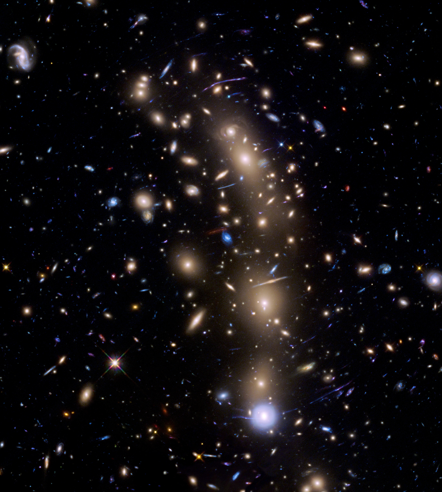

# Torus Animation

## Input Image



## Animated Torus Output


# What

This project/python script takes an image, and wraps it around a torus shape rendered to a plot. It then rotates the entire torus along both the u and v axes.

The u direction is the toroidal axis (around the donut), and the v direction is the poloidal axis (falling into the center of the donut).

The .mp4 output is also keyed to start and end on the exact same frame by default.

# Reverse

```bash
ffmpeg -i ./torus_spacetime_animation.mp4 -vf reverse -af areverse torus_spacetime_animation_reversed.mp4
```

# Convert to gif

```bash

ffmpeg -i torus_spacetime_animation.mp4 -vf "fps=30,scale=720:-1:flags=lanczos" output.gif

```
